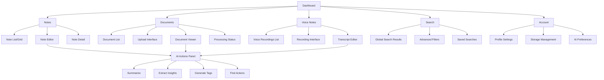
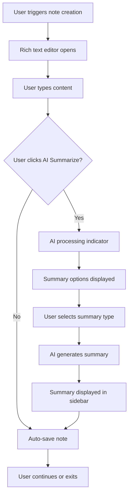
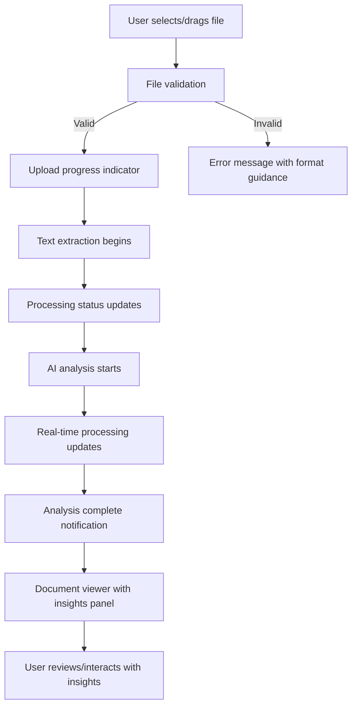

# AI Notes UI/UX Specification

## Introduction

This document defines the user experience goals, information architecture, user flows, and visual design specifications for AI Notes' user interface. It serves as the foundation for visual design and frontend development, ensuring a cohesive and user-centered experience.

### Overall UX Goals & Principles

#### Target User Personas

- **Knowledge Workers:** Professionals (consultants, researchers, managers) who need to capture and process large amounts of information daily
- **Meeting Facilitators:** Team leads and project managers who record meetings and need quick summaries and action items
- **Content Creators:** Writers, analysts, and creators who work with multiple content formats and need AI assistance for processing

#### Usability Goals

- **Rapid Capture:** Users can create notes, upload documents, or start voice recordings within 2 clicks from any screen
- **Intelligent Processing:** AI summarization and insights are generated within 30 seconds for typical content
- **Effortless Organization:** Content can be tagged and organized without interrupting the creation flow
- **Universal Search:** Users can find any content across all formats using natural language search

#### Design Principles

1. **AI-Augmented, Not AI-Dependent** - Users remain in control while AI enhances their productivity
2. **Seamless Multi-Modal Input** - Switching between text, voice, and document modes feels natural
3. **Progressive Intelligence** - AI features become more helpful as users provide more context
4. **Contextual Actions** - Relevant AI-powered actions appear when and where users need them
5. **Transparent Processing** - Users always understand what AI is doing and can intervene

#### Change Log

| Date | Version | Description | Author |
|------|---------|-------------|---------|
| 2025-01-28 | 1.0 | Initial specification creation | Sally (UX Expert) |

## Information Architecture (IA)

### Site Map / Screen Inventory

### Navigation Structure

**Primary Navigation:** Top-level horizontal navigation with Dashboard, Notes, Documents, Voice Notes, and Search as main sections. Account/settings accessible via user avatar dropdown.

**Secondary Navigation:** Context-sensitive sidebars within each section:
- Notes: Tags, folders, recent notes
- Documents: File types, processing status, folders
- Voice Notes: Recording history, transcription status
- Search: Filters, saved searches, search history

**Breadcrumb Strategy:** Hierarchical breadcrumbs for folder navigation and content organization. Format: Section > Folder > Subfolder > Content Item. Search results show: Search > Query > Results.

## User Flows

### Flow 1: Quick Note Creation with AI Summary

**User Goal:** Capture thoughts quickly and get AI insights without losing momentum

**Entry Points:** Dashboard quick action, global "+" button, keyboard shortcut

**Success Criteria:** Note created, content captured, AI summary generated, user continues workflow

#### Flow Diagram

#### Edge Cases & Error Handling:

- AI service unavailable: Show offline mode, queue for later processing
- Network interruption: Local storage backup, sync when reconnected
- Empty or very short content: Suggest minimum content length for effective summarization
- AI processing timeout: Allow manual retry, provide alternative manual tools

**Notes:** This flow prioritizes speed and non-interruption. AI features are additive, not blocking.

### Flow 2: Document Upload and Processing

**User Goal:** Extract insights from existing documents without manual reading

**Entry Points:** Dashboard upload area, drag-and-drop anywhere, documents section

**Success Criteria:** Document uploaded, text extracted, AI analysis complete, insights accessible

#### Flow Diagram

#### Edge Cases & Error Handling:

- Unsupported file format: Clear error with supported format list
- File too large: Compression options or chunked upload
- Corrupted file: Error detection with retry option
- OCR failure: Manual text input option
- AI analysis failure: Provide basic text extraction as fallback

**Notes:** Processing transparency is crucial - users need to understand wait times and status.

## Wireframes & Mockups

**Primary Design Files:** Figma workspace with component library foundation based on Shadcn-ui patterns

### Key Screen Layouts

#### Dashboard Overview

**Purpose:** Central hub for quick access to all content types and recent activity monitoring

**Key Elements:**
- Quick action toolbar (Create Note, Upload Document, Start Recording)
- Recent activity feed with mixed content types and timestamps
- Storage usage visualization with breakdown by content type
- Search bar with global scope and AI-powered suggestions
- Navigation sidebar with folder hierarchy and tags

**Interaction Notes:** Dashboard should feel alive with real-time updates. Quick actions need to be thumb-accessible on mobile. Storage visualization should be informative but not anxiety-inducing.

**Design File Reference:** [Figma Frame: Dashboard - Main View]

#### Note Editor with AI Panel

**Purpose:** Primary content creation interface with contextual AI assistance

**Key Elements:**
- Rich text editor with formatting toolbar (floating or fixed)
- AI actions sidebar (collapsed by default, expands with content)
- Auto-save status indicator (subtle but reassuring)
- Tags and folder assignment (quick access without modal)
- Export and sharing options (contextual menu)

**Interaction Notes:** AI panel should feel like a helpful assistant, not an intrusion. Summarization should show progressive enhancement. Editor needs excellent keyboard navigation for power users.

**Design File Reference:** [Figma Frame: Note Editor - with AI Panel Expanded]

#### Document Processing Status

**Purpose:** Transparent feedback during document upload and AI processing

**Key Elements:**
- Upload progress with file details (name, size, type)
- Processing stage indicators (Upload → Extract → Analyze → Complete)
- Estimated time remaining with realistic expectations
- Preview of extracted text as it becomes available
- Cancel/retry options for each stage

**Interaction Notes:** Processing should feel predictable and trustworthy. Users need to understand they can leave and return. Progress should be granular enough to prevent anxiety but not overwhelming.

**Design File Reference:** [Figma Frame: Document Processing - Multi-stage Status]

## Component Library / Design System

**Design System Approach:** Extend Shadcn-ui's component library with AI-specific components and enhanced accessibility patterns. This leverages proven primitives while allowing customization for AI interaction patterns unique to note-taking workflows.

### Core Components

#### AI Action Button

**Purpose:** Trigger AI processing with clear status feedback and user control

**Variants:**
- Primary (Summarize, Extract Insights)
- Secondary (Generate Tags, Find Actions)
- Contextual (appears based on content type)
- Batch (for multiple content items)

**States:** Default, Hover, Processing, Success, Error, Disabled, Loading

**Usage Guidelines:** Always provide processing feedback. Include cancel option for long operations. Use progressive enhancement - basic functionality works without AI.

#### Content Card

**Purpose:** Unified display for notes, documents, and voice recordings with consistent actions

**Variants:**
- Note Card (with text preview and AI summary badge)
- Document Card (with file type, size, processing status)
- Voice Card (with duration, transcription status, waveform preview)
- Mixed Search Result (adapts based on content type)

**States:** Default, Hover, Selected, Processing, Error, Archived

**Usage Guidelines:** Maintain visual hierarchy across content types. AI-generated metadata should be visually distinct from user content. Support both grid and list layouts.

#### Smart Search Input

**Purpose:** Global search with AI-powered suggestions and contextual filtering

**Variants:**
- Global (searches all content)
- Scoped (within folder or content type)
- Advanced (with visible filters)
- Recent (shows search history)

**States:** Empty, Typing, Suggesting, Searching, Results, No Results, Error

**Usage Guidelines:** Suggestions should appear quickly but not be distracting. Support both keyword and natural language queries. Remember user search patterns.

#### Processing Status Indicator

**Purpose:** Transparent feedback for AI operations with appropriate level of detail

**Variants:**
- Simple Progress (basic progress bar)
- Staged Progress (upload → process → analyze)
- Background Processing (minimal, non-intrusive)
- Detailed Status (with time estimates and technical details)

**States:** Queued, Processing, Paused, Complete, Failed, Cancelled

**Usage Guidelines:** Match detail level to user's current context. Provide realistic time estimates. Always include retry/cancel options.

## Branding & Style Guide

**Brand Guidelines:** [To be established - recommend creating brand guidelines that emphasize clarity, intelligence, and professional reliability]

### Color Palette

| Color Type | Hex Code | Usage |
|------------|----------|--------|
| Primary | #2563eb | Primary actions, AI features, key UI elements |
| Secondary | #64748b | Secondary text, subtle UI elements, borders |
| Accent | #f59e0b | Highlights, notifications, processing states |
| Success | #10b981 | Confirmations, completed processing, positive feedback |
| Warning | #f59e0b | Cautions, processing delays, important notices |
| Error | #ef4444 | Errors, failed operations, destructive actions |
| Neutral | #f8fafc, #e2e8f0, #64748b, #1e293b | Text hierarchy, backgrounds, borders |

### Typography

#### Font Families
- **Primary:** Inter (clean, highly legible, professional)
- **Secondary:** Inter (consistent family for hierarchy)
- **Monospace:** JetBrains Mono (for code, technical content, timestamps)

#### Type Scale

| Element | Size | Weight | Line Height |
|---------|------|--------|-------------|
| H1 | 2.25rem (36px) | 700 | 1.2 |
| H2 | 1.875rem (30px) | 600 | 1.3 |
| H3 | 1.5rem (24px) | 600 | 1.4 |
| Body | 1rem (16px) | 400 | 1.6 |
| Small | 0.875rem (14px) | 400 | 1.5 |

### Iconography

**Icon Library:** Lucide React - provides consistent, minimal icons with excellent accessibility

**Usage Guidelines:** Use outline style for primary actions, filled style for active/selected states. Maintain 24px standard size with 16px for compact contexts. Ensure icons have accessible labels and sufficient contrast.

### Spacing & Layout

**Grid System:** 8px base unit with 4px micro-adjustments for fine-tuning. 12-column responsive grid with consistent gutters.

**Spacing Scale:** 4px, 8px, 12px, 16px, 24px, 32px, 48px, 64px, 96px (based on 4px increment system for pixel-perfect alignment)

## Accessibility Requirements

**Compliance Target:**
**Standard:** WCAG 2.1 AA compliance with select AAA features for enhanced usability

### Key Requirements

**Visual:**
- Color contrast ratios: 4.5:1 minimum for normal text, 3:1 for large text, 7:1 for critical AI status indicators
- Focus indicators: 2px solid outline with high contrast, visible on all interactive elements including AI action buttons
- Text sizing: Support zoom up to 200% without horizontal scrolling, scalable typography for AI-generated content

**Interaction:**
- Keyboard navigation: Full keyboard access to all features including AI controls, logical tab order, escape key cancels AI operations
- Screen reader support: ARIA labels for all AI processing states, live regions for status updates, descriptive text for AI-generated content
- Touch targets: Minimum 44px touch targets, adequate spacing between AI action buttons, gesture alternatives for drag-and-drop

**Content:**
- Alternative text: Meaningful descriptions for icons, AI status indicators, and any generated visual content
- Heading structure: Logical H1-H6 hierarchy throughout all content views and AI panels
- Form labels: Clear, descriptive labels for all inputs including search and AI configuration options

### Testing Strategy

**Automated Testing:** Integrate axe-core accessibility testing into the development pipeline. Run automated checks on all components, especially AI interaction elements.

**Manual Testing:** Regular testing with keyboard-only navigation, screen readers (NVDA, JAWS, VoiceOver), and voice control software. Test AI features specifically for accessibility.

**User Testing:** Include users with disabilities in usability testing, particularly for AI workflow testing since these interaction patterns are still evolving.

## Responsiveness Strategy

### Breakpoints

| Breakpoint | Min Width | Max Width | Target Devices |
|------------|-----------|-----------|----------------|
| Mobile | 320px | 767px | Smartphones, quick capture scenarios |
| Tablet | 768px | 1023px | Tablets, reading/reviewing content |
| Desktop | 1024px | 1439px | Laptops, primary work sessions |
| Wide | 1440px | - | Large monitors, power users with multiple content views |

### Adaptation Patterns

**Layout Changes:**
- Mobile: Single column, stacked navigation, full-screen editors
- Tablet: Sidebar navigation, split-view for content+details
- Desktop: Multi-column layouts, persistent sidebars, contextual panels
- Wide: Multi-pane views, side-by-side content comparison

**Navigation Changes:**
- Mobile: Hamburger menu with gesture navigation, tab bar for primary sections
- Tablet: Collapsible sidebar, gesture-friendly touch targets
- Desktop: Persistent sidebar navigation, keyboard shortcuts
- Wide: Full navigation hierarchy visible, multiple content areas

**Content Priority:**
- Mobile: Focus on capture and quick actions, minimal AI UI complexity
- Tablet: Balance between capture and review, moderate AI feature exposure
- Desktop: Full feature set, complex AI workflows, batch operations
- Wide: Advanced features, multiple simultaneous AI operations, analytics

**Interaction Changes:**
- Mobile: Thumb-friendly touch targets, swipe gestures, voice input emphasis
- Tablet: Touch-optimized but precise interactions, stylus support consideration
- Desktop: Mouse and keyboard optimization, hover states, right-click menus
- Wide: Advanced keyboard shortcuts, drag-and-drop workflows, multi-selection

## Animation & Micro-interactions

### Motion Principles

**Purposeful Motion:** Every animation serves a functional purpose - providing feedback, guiding attention, or maintaining spatial relationships. Avoid decorative animations that don't enhance usability.

**Respectful Timing:** Animations respect user time and attention. Quick feedback (100-200ms), moderate transitions (200-400ms), complex state changes (400-600ms). Always provide motion reduction options.

**AI-Aware Animation:** Processing animations should feel intelligent and purposeful, not mechanical. Use organic easing curves and variable timing to suggest AI "thinking" rather than simple computation.

### Key Animations

- **AI Processing Pulse:** Subtle breathing animation for AI action buttons during processing (Duration: 2000ms, Easing: ease-in-out, infinite loop)
- **Content Appearance:** Smooth fade-in with slight upward movement for AI-generated content (Duration: 300ms, Easing: cubic-bezier(0.16, 1, 0.3, 1))
- **Status Transitions:** Color and icon transitions for processing states (Duration: 200ms, Easing: ease-out)
- **Panel Expansion:** AI sidebar slides in with content fade-in (Duration: 400ms, Easing: cubic-bezier(0.25, 0.46, 0.45, 0.94))
- **Search Results:** Staggered appearance of search results (Duration: 150ms per item, Easing: ease-out, 50ms delay between items)
- **Upload Progress:** Smooth progress bar with anticipatory easing (Duration: Variable, Easing: cubic-bezier(0.65, 0, 0.35, 1))
- **Error States:** Gentle shake for form errors, fade-in for error messages (Duration: 250ms, Easing: ease-in-out)
- **Success Confirmation:** Brief scale animation for successful actions (Duration: 200ms, Easing: cubic-bezier(0.68, -0.55, 0.265, 1.55))

## Performance Considerations

### Performance Goals

- **Page Load:** Initial app load under 2 seconds on 3G, dashboard ready in under 1 second on cable/wifi
- **Interaction Response:** UI feedback within 100ms for all user actions, even during AI processing
- **Animation FPS:** Maintain 60fps for all animations, graceful degradation to 30fps on lower-end devices

### Design Strategies

**Progressive Loading:** Design interfaces that work well with incremental content loading. Show content structure first, then populate with data. AI-generated content appears in dedicated, clearly marked areas that don't shift existing layout.

**Optimistic UI Patterns:** Design interactions that provide immediate feedback even when AI processing takes time. Show expected content areas immediately, populate when ready. Use skeleton screens for predictable content layouts.

**Graceful Degradation:** Design core workflows to function without AI features when services are unavailable. AI enhancements should feel additive, not essential for basic functionality.

**Intelligent Caching:** Design content displays that work well with cached AI results. Show when content is AI-generated vs. user-created. Indicate when AI analysis is fresh vs. cached.

**Chunked Processing:** Design file upload interfaces that communicate progress clearly for large documents. Show incremental results as text extraction and AI analysis proceed.

**Background Operations:** Design notification systems for AI operations that can complete while users work on other tasks. Provide clear status and results when operations complete.

## Next Steps

### Immediate Actions

1. **Stakeholder Review Session** - Schedule review with product team, engineering leads, and key stakeholders to validate UX approach and identify any concerns
2. **Design Tool Setup** - Create Figma workspace with component library foundation based on Shadcn-ui patterns defined in this spec
3. **Accessibility Audit Plan** - Establish accessibility testing protocols and tools integration for the development pipeline
4. **Performance Baseline** - Define measurement tools and benchmarks for the performance goals established in this specification
5. **User Research Planning** - Design usability testing protocol specifically for AI interaction patterns with target professional users

### Design Handoff Checklist

- [x] All user flows documented
- [x] Component inventory complete
- [x] Accessibility requirements defined
- [x] Responsive strategy clear
- [x] Brand guidelines incorporated
- [x] Performance goals established

## Checklist Results

*This section will be populated when a UI/UX checklist is run against this document.*